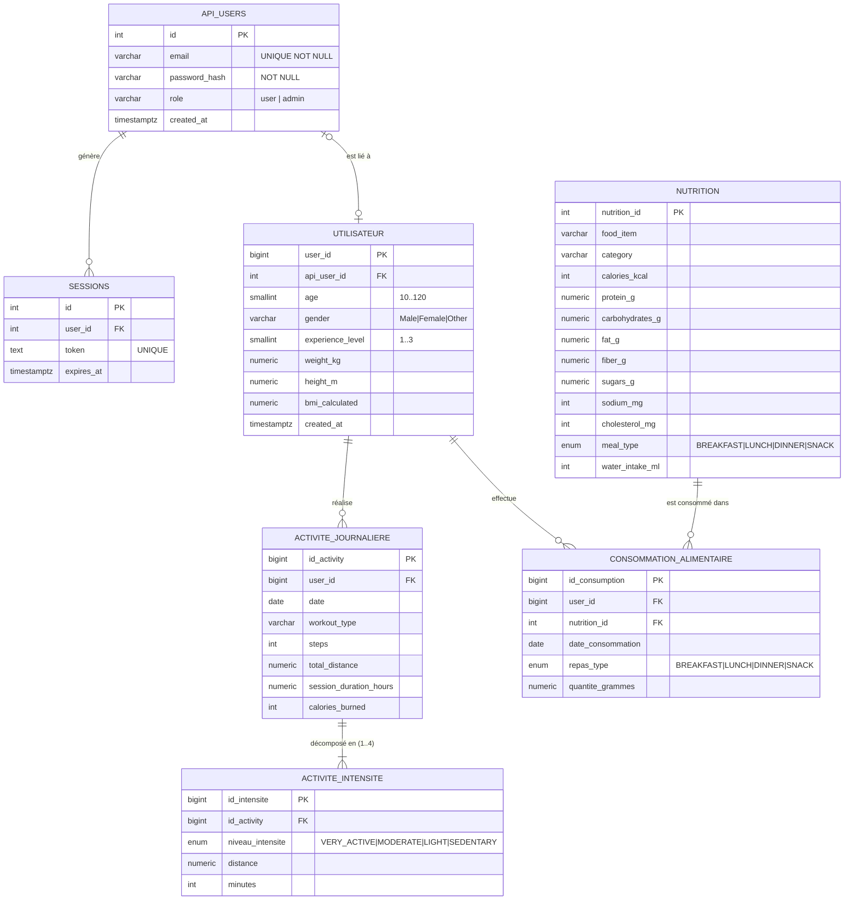

# MCD et MLD — HealthAI Coach

**Méthode :** Merise  
**Base :** PostgreSQL 15 — schéma `healthai`  
**Projet :** MSPR HealthAI Coach — Pipeline ETL + API REST + Frontend React

---

## Table des matières

1. [MCD — Modèle Conceptuel de Données](#1-mcd--modèle-conceptuel-de-données)
2. [MLD — Modèle Logique de Données](#2-mld--modèle-logique-de-données)
3. [Diagramme ER (Mermaid)](#3-diagramme-er-mermaid)
4. [Règles de gestion](#4-règles-de-gestion)
5. [Types et contraintes](#5-types-et-contraintes)

---

## 1. MCD — Modèle Conceptuel de Données

### 1.1 Entités

---

#### COMPTE_UTILISATEUR
> Compte d'authentification créé via l'API.

| Attribut | Description |
|---|---|
| **# id** | Identifiant technique (auto-incrémenté) |
| email | Adresse email unique |
| password_hash | Mot de passe haché (bcrypt) |
| role | Rôle applicatif : `user` ou `admin` |
| created_at | Date de création du compte |

---

#### SESSION
> Token JWT actif associé à un compte. Permet la révocation des sessions.

| Attribut | Description |
|---|---|
| **# id** | Identifiant technique |
| token | Valeur du JWT (unique) |
| expires_at | Date d'expiration du token |

---

#### PROFIL_SANTE
> Profil physique d'un utilisateur, issu du pipeline ETL (données Kaggle).

| Attribut | Description |
|---|---|
| **# user_id** | Identifiant hérité du dataset source |
| age | Âge en années (10–120) |
| gender | Genre : `Male`, `Female`, `Other` |
| experience_level | Niveau sportif : 1 (débutant), 2 (intermédiaire), 3 (avancé) |
| weight_kg | Poids en kilogrammes |
| height_m | Taille en mètres |
| bmi_calculated | IMC calculé : poids / taille² |
| created_at | Date d'insertion |

---

#### ACTIVITE_JOURNALIERE
> Séance sportive d'un jour donné pour un profil santé.

| Attribut | Description |
|---|---|
| **# id_activity** | Identifiant auto-incrémenté |
| date | Date de la séance (DATE) |
| workout_type | Type d'entraînement (Running, Cycling, etc.) |
| steps | Nombre de pas (≥ 0) |
| total_distance | Distance totale en km (≥ 0) |
| session_duration_hours | Durée en heures (≥ 0) |
| calories_burned | Calories dépensées (≥ 0) |

---

#### DETAIL_INTENSITE
> Décomposition d'une séance en 4 niveaux d'intensité (VERY_ACTIVE, MODERATE, LIGHT, SEDENTARY). Toujours 4 lignes par séance.

| Attribut | Description |
|---|---|
| **# id_intensite** | Identifiant auto-incrémenté |
| niveau_intensite | Niveau : `VERY_ACTIVE`, `MODERATE`, `LIGHT`, `SEDENTARY` |
| distance | Distance réalisée à ce niveau (km, nullable) |
| minutes | Minutes passées à ce niveau (≥ 0) |

---

#### ALIMENT
> Référentiel nutritionnel (591 aliments issus du dataset Kaggle).

| Attribut | Description |
|---|---|
| **# nutrition_id** | Identifiant numérique |
| food_item | Nom de l'aliment |
| category | Catégorie alimentaire |
| calories_kcal | Calories pour 100 g (kcal) |
| protein_g | Protéines en grammes |
| carbohydrates_g | Glucides en grammes |
| fat_g | Lipides en grammes |
| fiber_g | Fibres en grammes |
| sugars_g | Sucres en grammes |
| sodium_mg | Sodium en milligrammes |
| cholesterol_mg | Cholestérol en milligrammes |
| meal_type | Repas conseillé : `BREAKFAST`, `LUNCH`, `DINNER`, `SNACK` |
| water_intake_ml | Apport en eau en millilitres |

---

#### CONSOMMATION_ALIMENTAIRE
> Lien entre un profil santé et un aliment consommé à une date donnée.  
> (Entité-association portant les données propres à la consommation)

| Attribut | Description |
|---|---|
| **# id_consumption** | Identifiant technique |
| date_consommation | Date de consommation (DATE) |
| repas_type | Repas : `BREAKFAST`, `LUNCH`, `DINNER`, `SNACK` |
| quantite_grammes | Quantité consommée en grammes (> 0) |

---

#### EXERCICE
> Référentiel des exercices physiques (table de référence).

| Attribut | Description |
|---|---|
| **# exercise_name** | Nom de l'exercice (PK naturelle) |
| category | Catégorie (Cardio, Force, Souplesse…) |
| difficulty | Niveau de difficulté |
| equipment | Équipement requis |
| calories_per_hour | Calories brûlées par heure |
| muscle_groups | Groupes musculaires sollicités |
| description | Description textuelle |

---

### 1.2 Associations et cardinalités

```
┌────────────────────────────────────────────────────────────────────────────┐
│                    MCD — HealthAI Coach (Merise)                           │
└────────────────────────────────────────────────────────────────────────────┘

  ┌─────────────────────┐          ┌────────────────┐
  │  COMPTE_UTILISATEUR │──(1,1)──<│    génère      │>──(0,N)──┐
  │  # id               │          └────────────────┘          │
  │  email              │                                       ▼
  │  password_hash      │                             ┌─────────────────┐
  │  role               │                             │    SESSION      │
  │  created_at         │                             │  # id           │
  └──────────┬──────────┘                             │  token          │
             │                                        │  expires_at     │
         (0,1)                                        └─────────────────┘
             │
         ┌───┴────────┐
         │  est_lié_à │  ← association 1-1
         └───┬────────┘
         (0,1)
             │
  ┌──────────▼──────────┐
  │    PROFIL_SANTE     │
  │  # user_id          │
  │  age                │
  │  gender             │──(1,1)──<│  réalise  │>──(0,N)──┐
  │  experience_level   │          └───────────┘           │
  │  weight_kg          │                                  ▼
  │  height_m           │                    ┌─────────────────────────┐
  │  bmi_calculated     │                    │  ACTIVITE_JOURNALIERE   │
  │  created_at         │──(1,1)──<│ effectue │>──(0,N)──┐ # id_activity│
  └─────────────────────┘          └─────────┘           │ date         │
                                              │           │ workout_type │
                                              │           │ steps        │
  ┌─────────────────────┐                    │           │ total_dist.  │
  │       ALIMENT       │──(1,1)──<│ est_    │           │ duration_h   │
  │  # nutrition_id     │          │ conso.  │>──(0,N)──┐│ calories     │
  │  food_item          │          └─────────┘          ││             ┌┘
  │  category           │                               ▼│         (1,1)
  │  calories_kcal      │                ┌──────────────────┐         │
  │  protein_g          │                │   CONSOMMATION   │         │
  │  carbohydrates_g    │                │  # id_consomm.   │     ┌───▼──────────────────┐
  │  fat_g              │                │  date_consomm.   │     │  DETAIL_INTENSITE    │
  │  fiber_g            │                │  repas_type      │     │  # id_intensite      │
  │  sugars_g           │                │  quantite_g      │     │  niveau_intensite    │
  │  sodium_mg          │                └──────────────────┘     │  distance            │
  │  cholesterol_mg     │                                          │  minutes             │
  │  meal_type          │                                          └──────────────────────┘
  │  water_intake_ml    │
  └─────────────────────┘

  ┌─────────────────────┐   (référentiel indépendant)
  │      EXERCICE       │
  │  # exercise_name    │
  │  category           │
  │  difficulty         │
  │  equipment          │
  │  calories_per_hour  │
  │  muscle_groups      │
  │  description        │
  └─────────────────────┘
```

### 1.3 Tableau des associations

| Association | Entité A | Card. A | Card. B | Entité B | Description |
|---|---|:---:|:---:|---|---|
| `génère` | COMPTE_UTILISATEUR | (1,1) | (0,N) | SESSION | Un compte génère 0..N sessions JWT actives |
| `est_lié_à` | COMPTE_UTILISATEUR | (0,1) | (0,1) | PROFIL_SANTE | Un compte peut être lié à 0 ou 1 profil santé |
| `réalise` | PROFIL_SANTE | (1,1) | (0,N) | ACTIVITE_JOURNALIERE | Un profil possède 0..N activités journalières |
| `décomposé_en` | ACTIVITE_JOURNALIERE | (1,1) | (1,4) | DETAIL_INTENSITE | Chaque séance est décomposée en 4 niveaux d'intensité |
| `effectue` | PROFIL_SANTE | (1,1) | (0,N) | CONSOMMATION_ALIMENTAIRE | Un profil enregistre 0..N consommations alimentaires |
| `est_consommé_dans` | ALIMENT | (1,1) | (0,N) | CONSOMMATION_ALIMENTAIRE | Un aliment peut figurer dans 0..N consommations |

---

## 2. MLD — Modèle Logique de Données

> **Convention :**
> - `#` = Clé primaire (PK)
> - `@` = Clé étrangère (FK)
> - Souligné = identifiant principal
> - `NOT NULL` = obligatoire

### 2.1 Tables relationnelles

```
─────────────────────────────────────────────────────────────────────
API_USERS
─────────────────────────────────────────────────────────────────────
  # id            SERIAL          NOT NULL  PK
    email         VARCHAR(255)    NOT NULL  UNIQUE
    password_hash VARCHAR(255)    NOT NULL
    role          VARCHAR(20)     NOT NULL  DEFAULT 'user'
                                            CHECK (role IN ('user','admin'))
    created_at    TIMESTAMPTZ     NOT NULL  DEFAULT now()

─────────────────────────────────────────────────────────────────────
SESSIONS
─────────────────────────────────────────────────────────────────────
  # id            SERIAL          NOT NULL  PK
  @ user_id       INT             NOT NULL  FK → API_USERS(id) CASCADE DELETE
    token         TEXT            NOT NULL  UNIQUE
    expires_at    TIMESTAMPTZ     NOT NULL

─────────────────────────────────────────────────────────────────────
UTILISATEUR  (PROFIL_SANTE)
─────────────────────────────────────────────────────────────────────
  # user_id          BIGINT       NOT NULL  PK
  @ api_user_id      INT                    FK → API_USERS(id) SET NULL
    age              SMALLINT     NOT NULL  CHECK (10..120)
    gender           VARCHAR(20)  NOT NULL  CHECK ('Male','Female','Other')
    experience_level SMALLINT     NOT NULL  CHECK (1..3)
    weight_kg        NUMERIC(6,2) NOT NULL  CHECK (> 0)
    height_m         NUMERIC(4,2) NOT NULL  CHECK (> 0)
    bmi_calculated   NUMERIC(6,2) NOT NULL
    created_at       TIMESTAMPTZ  NOT NULL  DEFAULT now()

─────────────────────────────────────────────────────────────────────
ACTIVITE_JOURNALIERE
─────────────────────────────────────────────────────────────────────
  # id_activity            BIGSERIAL    NOT NULL  PK
  @ user_id                BIGINT       NOT NULL  FK → UTILISATEUR(user_id) CASCADE DELETE
    date                   DATE         NOT NULL
    workout_type           VARCHAR(50)  NOT NULL
    steps                  INT          NOT NULL  CHECK (>= 0)
    total_distance         NUMERIC(8,2) NOT NULL  CHECK (>= 0)
    session_duration_hours NUMERIC(5,2) NOT NULL  CHECK (>= 0)
    calories_burned        INT          NOT NULL  CHECK (>= 0)

─────────────────────────────────────────────────────────────────────
ACTIVITE_INTENSITE  (DETAIL_INTENSITE)
─────────────────────────────────────────────────────────────────────
  # id_intensite     BIGSERIAL           NOT NULL  PK
  @ id_activity      BIGINT              NOT NULL  FK → ACTIVITE_JOURNALIERE(id_activity) CASCADE DELETE
    niveau_intensite niveau_intensite_t  NOT NULL  ENUM ('VERY_ACTIVE','MODERATE','LIGHT','SEDENTARY')
    distance         NUMERIC(8,2)                  CHECK (>= 0)   -- nullable
    minutes          INT                 NOT NULL  CHECK (>= 0)
    UNIQUE (id_activity, niveau_intensite)

─────────────────────────────────────────────────────────────────────
NUTRITION  (ALIMENT)
─────────────────────────────────────────────────────────────────────
  # nutrition_id    INT          NOT NULL  PK
    food_item       VARCHAR(255) NOT NULL
    category        VARCHAR(100) NOT NULL
    calories_kcal   INT          NOT NULL  CHECK (>= 0)
    protein_g       NUMERIC(6,2) NOT NULL  CHECK (>= 0)
    carbohydrates_g NUMERIC(6,2) NOT NULL  CHECK (>= 0)
    fat_g           NUMERIC(6,2) NOT NULL  CHECK (>= 0)
    fiber_g         NUMERIC(6,2) NOT NULL  CHECK (>= 0)
    sugars_g        NUMERIC(6,2) NOT NULL  CHECK (>= 0)
    sodium_mg       INT          NOT NULL  CHECK (>= 0)
    cholesterol_mg  INT          NOT NULL  CHECK (>= 0)
    meal_type       repas_type_t NOT NULL  ENUM ('BREAKFAST','LUNCH','DINNER','SNACK')
    water_intake_ml INT          NOT NULL  CHECK (>= 0)

─────────────────────────────────────────────────────────────────────
CONSOMMATION_ALIMENTAIRE
─────────────────────────────────────────────────────────────────────
  # id_consumption    BIGINT       NOT NULL  PK
  @ user_id           BIGINT       NOT NULL  FK → UTILISATEUR(user_id) CASCADE DELETE
  @ nutrition_id      INT          NOT NULL  FK → NUTRITION(nutrition_id)
    date_consommation DATE         NOT NULL
    repas_type        repas_type_t NOT NULL  ENUM ('BREAKFAST','LUNCH','DINNER','SNACK')
    quantite_grammes  NUMERIC(7,2) NOT NULL  CHECK (> 0)

─────────────────────────────────────────────────────────────────────
EXERCICE
─────────────────────────────────────────────────────────────────────
  # exercise_name     VARCHAR(100)  NOT NULL  PK
    category          VARCHAR(100)
    difficulty        VARCHAR(50)
    equipment         VARCHAR(100)
    calories_per_hour INT           CHECK (>= 0)
    muscle_groups     VARCHAR(255)
    description       TEXT
```

### 2.2 Vues analytiques

Les 6 vues suivantes sont des projections calculées — elles ne stockent pas de données propres.

| Vue | Tables sources | Description |
|---|---|---|
| `v_profil_utilisateur` | utilisateur, activite_journaliere | Profil + agrégats de séances (nb, moy cal, moy durée, total steps) |
| `v_resume_journalier` | activite_journaliere, consommation_alimentaire, nutrition | Résumé quotidien activité + nutrition par utilisateur |
| `v_bilan_calorique` | activite_journaliere, consommation_alimentaire, nutrition | Balance énergétique (calories dépensées − consommées) |
| `v_apport_nutritionnel` | consommation_alimentaire, nutrition | Détail des macronutriments par repas et par jour |
| `v_intensite_seance` | activite_journaliere, activite_intensite | Répartition minutes par niveau d'intensité par séance |
| `v_kpi_dashboard` | Toutes tables | KPI globaux pour le tableau de bord |

### 2.3 Schéma de dépendances (ordre d'insertion)

```
API_USERS
    └── SESSIONS           (FK → api_users.id)
    └── UTILISATEUR        (FK → api_users.id  — nullable)
            └── ACTIVITE_JOURNALIERE    (FK → utilisateur.user_id)
            │       └── ACTIVITE_INTENSITE  (FK → activite_journaliere.id_activity)
            └── CONSOMMATION_ALIMENTAIRE   (FK → utilisateur.user_id)
                    └── NUTRITION          (FK → nutrition.nutrition_id)

NUTRITION      (indépendant — référentiel)
EXERCICE       (indépendant — référentiel)
```

**Ordre de chargement requis :**
1. `NUTRITION` et `EXERCICE` (référentiels sans dépendances)
2. `API_USERS`
3. `UTILISATEUR`
4. `ACTIVITE_JOURNALIERE`
5. `ACTIVITE_INTENSITE`
6. `CONSOMMATION_ALIMENTAIRE`
7. `SESSIONS` (créées à la connexion, pas en import)

---

## 3. Diagramme ER (Mermaid)



---

## 4. Règles de gestion

| Réf | Règle |
|---|---|
| RG-01 | Un compte utilisateur ne peut être lié qu'à **un seul** profil santé (1-1). |
| RG-02 | Un profil santé peut exister **sans** compte lié (profil importé non encore attribué). |
| RG-03 | La suppression d'un compte n'efface **pas** le profil santé (SET NULL sur `api_user_id`). |
| RG-04 | La suppression d'un profil santé efface **en cascade** toutes ses activités et consommations. |
| RG-05 | La suppression d'une activité journalière efface **en cascade** ses 4 lignes d'intensité. |
| RG-06 | Chaque séance comporte **exactement 4** niveaux d'intensité (contrainte UNIQUE sur id_activity + niveau). |
| RG-07 | La quantité consommée doit être **strictement positive** (> 0). |
| RG-08 | Les calories, steps, distances et minutes doivent être **non négatifs** (>= 0). |
| RG-09 | L'IMC est **calculé** automatiquement par le pipeline ETL : `bmi = weight_kg / height_m²`. |
| RG-10 | Les sessions JWT expirent automatiquement après **24 heures**. |
| RG-11 | Seul un **admin** peut créer, modifier ou supprimer des données via l'API. |
| RG-12 | Un utilisateur ne peut accéder qu'aux données liées à **son propre** profil santé. |

---

## 5. Types et contraintes

### Types ENUM PostgreSQL

```sql
CREATE TYPE niveau_intensite_t AS ENUM (
    'VERY_ACTIVE',
    'MODERATE',
    'LIGHT',
    'SEDENTARY'
);

CREATE TYPE repas_type_t AS ENUM (
    'BREAKFAST',
    'LUNCH',
    'DINNER',
    'SNACK'
);
```

### Index créés

| Table | Index | Colonnes | Type |
|---|---|---|---|
| utilisateur | IX_utilisateur_api_user | api_user_id | B-tree |
| activite_journaliere | IX_activite_user | user_id | B-tree |
| activite_journaliere | IX_activite_date | date | B-tree |
| activite_journaliere | IX_activite_workout | workout_type | B-tree |
| activite_intensite | IX_intensite_activity | id_activity | B-tree |
| nutrition | IX_nutrition_category | category | B-tree |
| nutrition | IX_nutrition_meal | meal_type | B-tree |
| consommation_alimentaire | IX_conso_user | user_id | B-tree |
| consommation_alimentaire | IX_conso_date | date_consommation | B-tree |
| consommation_alimentaire | IX_conso_nutrition | nutrition_id | B-tree |
| sessions | IX_sessions_token | token | B-tree |
| sessions | IX_sessions_user | user_id | B-tree |

### Récapitulatif des tables

| Table | Lignes (production) | PK | FK |
|---|:---:|---|---|
| api_users | N | id | — |
| sessions | N (actives) | id | api_users.id |
| utilisateur | 33 (liés) / 973 (bruts) | user_id | api_users.id |
| activite_journaliere | 940 | id_activity | utilisateur.user_id |
| activite_intensite | ~3 760 | id_intensite | activite_journaliere.id_activity |
| nutrition | 591 | nutrition_id | — |
| consommation_alimentaire | 2 856 | id_consumption | utilisateur.user_id, nutrition.nutrition_id |
| exercice | N | exercise_name | — |
