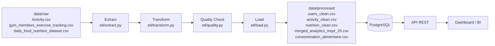
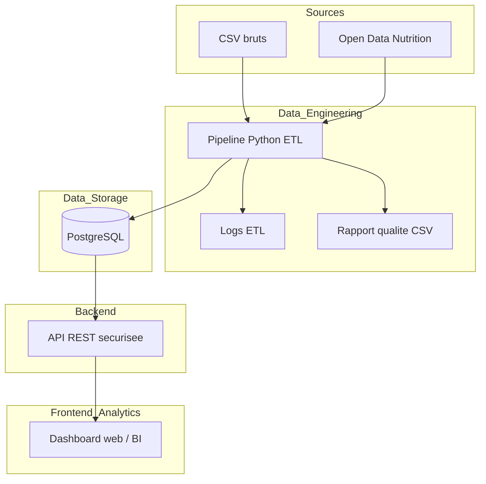
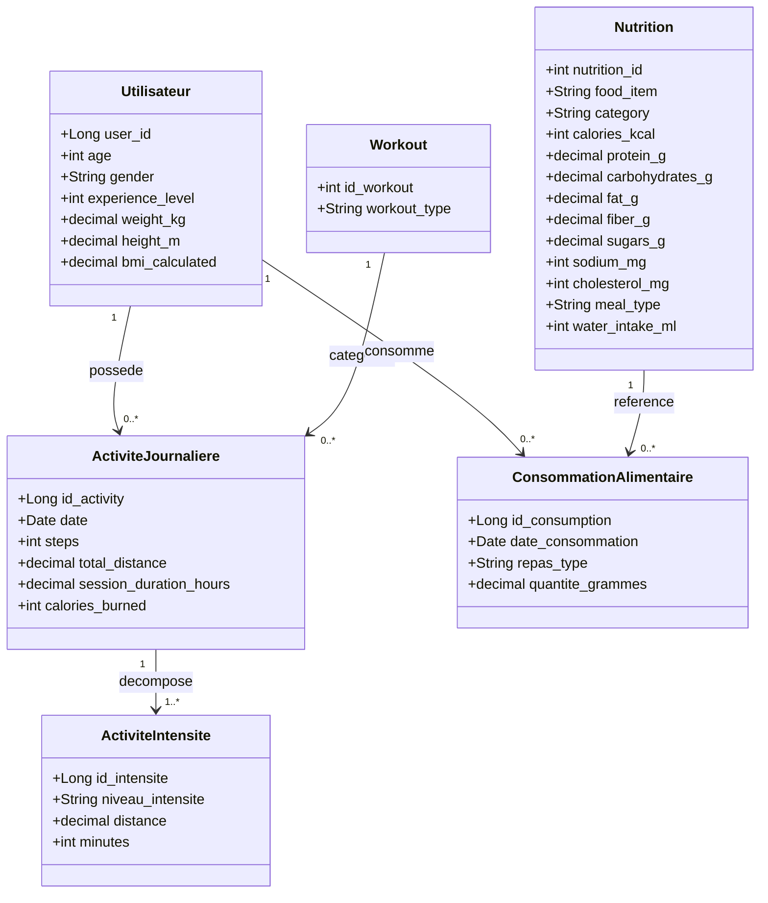
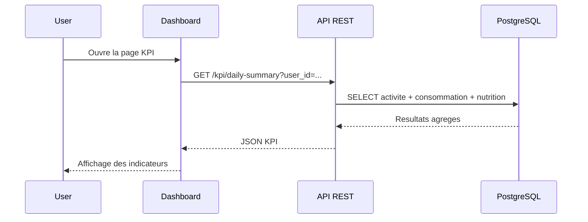

# Diagrammes MSPR

Ce document contient les 3 diagrammes demandes pour la soutenance :

1. Diagramme de flux de donnees (DFD)
2. Diagramme d'architecture technique
3. Diagrammes UML (classes + sequence)

---

## 1) Diagramme de flux de donnees (DFD)

---

## 2) Diagramme d'architecture technique

---

## 3) UML

### 3.1 Diagramme de classes (modele metier)

### 3.2 Diagramme de sequence (requete dashboard)

