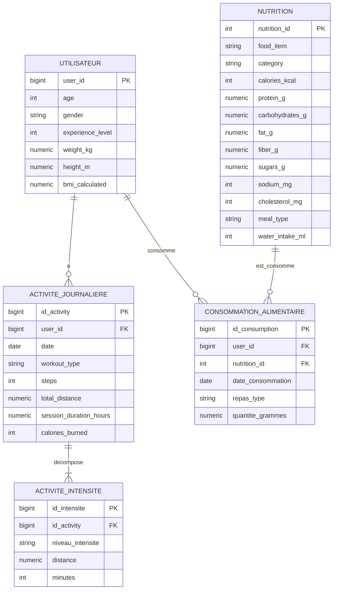

# MCD - Base finale (2 CSV)

Ce MCD est strictement base sur les 2 jeux finaux :

- `data/processed/merged_analytics_mspr_20.csv`
- `data/processed/nutrition_clean.csv`

## 1) MCD (Merise) cible (normalise)

### Entites

- **UTILISATEUR** (derive de `merged_analytics_mspr_20.csv`)
  - user_id
  - age
  - gender
  - experience_level
  - weight_kg
  - height_m
  - bmi_calculated

- **ACTIVITE_JOURNALIERE** (derive de `merged_analytics_mspr_20.csv`)
  - id_activity
  - user_id
  - date
  - workout_type
  - steps
  - total_distance
  - session_duration_hours
  - calories_burned

- **ACTIVITE_INTENSITE** (derive de `merged_analytics_mspr_20.csv`)
  - id_intensite
  - id_activity
  - niveau_intensite (VERY_ACTIVE, MODERATE, LIGHT, SEDENTARY)
  - distance
  - minutes

- **NUTRITION** (issu de `nutrition_clean.csv`)
  - nutrition_id
  - food_item
  - category
  - calories_kcal
  - protein_g
  - carbohydrates_g
  - fat_g
  - fiber_g
  - sugars_g
  - sodium_mg
  - cholesterol_mg
  - meal_type
  - water_intake_ml

- **CONSOMMATION_ALIMENTAIRE** (enrichissement simule pour relier nutrition aux utilisateurs)
  - id_consumption
  - user_id
  - nutrition_id
  - date_consommation
  - repas_type (BREAKFAST, LUNCH, DINNER, SNACK)
  - quantite_grammes

### Associations et cardinalites

- UTILISATEUR (1, N) ACTIVITE_JOURNALIERE  
  Un utilisateur possede 0..N activites journalieres, chaque ligne d'activite appartient a 1 utilisateur.

- ACTIVITE_JOURNALIERE (1, N) ACTIVITE_INTENSITE  
  Une activite journaliere est decomposee en 4 niveaux d'intensite.
  Chaque ligne d'intensite appartient a 1 activite journaliere.

- UTILISATEUR (1, N) CONSOMMATION_ALIMENTAIRE  
  Un utilisateur peut avoir 0..N consommations alimentaires.

- NUTRITION (1, N) CONSOMMATION_ALIMENTAIRE  
  Un aliment du referentiel peut etre consomme 0..N fois.

## 2) Diagramme (Mermaid)



## 3) Traduction relationnelle (MLD/SQL)

```sql
CREATE TABLE IF NOT EXISTS utilisateur (
    user_id BIGINT PRIMARY KEY,
    age INT NOT NULL,
    gender VARCHAR(20) NOT NULL,
    experience_level INT NOT NULL,
    weight_kg NUMERIC(6,2) NOT NULL,
    height_m NUMERIC(4,2) NOT NULL,
    bmi_calculated NUMERIC(6,2) NOT NULL
);

CREATE TABLE IF NOT EXISTS activite_journaliere (
    id_activity BIGSERIAL PRIMARY KEY,
    user_id BIGINT NOT NULL REFERENCES utilisateur(user_id),
    date DATE NOT NULL,
    workout_type VARCHAR(50) NOT NULL,
    steps INT NOT NULL,
    total_distance NUMERIC(8,2) NOT NULL,
    session_duration_hours NUMERIC(4,2) NOT NULL,
    calories_burned INT NOT NULL,
    CONSTRAINT uq_activite_user_date UNIQUE (user_id, date)
);

CREATE TABLE IF NOT EXISTS activite_intensite (
    id_intensite BIGSERIAL PRIMARY KEY,
    id_activity BIGINT NOT NULL REFERENCES activite_journaliere(id_activity),
    niveau_intensite VARCHAR(20) NOT NULL,
    distance NUMERIC(8,2),
    minutes INT NOT NULL,
    CONSTRAINT uq_activite_intensite UNIQUE (id_activity, niveau_intensite),
    CONSTRAINT ck_niveau_intensite
        CHECK (niveau_intensite IN ('VERY_ACTIVE', 'MODERATE', 'LIGHT', 'SEDENTARY'))
);

CREATE TABLE IF NOT EXISTS nutrition (
    nutrition_id INT PRIMARY KEY,
    food_item VARCHAR(255) NOT NULL,
    category VARCHAR(100) NOT NULL,
    calories_kcal INT NOT NULL,
    protein_g NUMERIC(6,2) NOT NULL,
    carbohydrates_g NUMERIC(6,2) NOT NULL,
    fat_g NUMERIC(6,2) NOT NULL,
    fiber_g NUMERIC(6,2) NOT NULL,
    sugars_g NUMERIC(6,2) NOT NULL,
    sodium_mg INT NOT NULL,
    cholesterol_mg INT NOT NULL,
    meal_type VARCHAR(50) NOT NULL,
    water_intake_ml INT NOT NULL
);

CREATE TABLE IF NOT EXISTS consommation_alimentaire (
    id_consumption BIGSERIAL PRIMARY KEY,
    user_id BIGINT NOT NULL REFERENCES utilisateur(user_id),
    nutrition_id INT NOT NULL REFERENCES nutrition(nutrition_id),
    date_consommation DATE NOT NULL,
    repas_type VARCHAR(20) NOT NULL,
    quantite_grammes NUMERIC(7,2) NOT NULL,
    CONSTRAINT ck_repas_type
        CHECK (repas_type IN ('BREAKFAST', 'LUNCH', 'DINNER', 'SNACK')),
    CONSTRAINT ck_quantite_positive
        CHECK (quantite_grammes > 0)
);
```

### Option simple d'alimentation depuis `merged_analytics_mspr_20.csv`

```sql
INSERT INTO utilisateur (user_id, age, gender, experience_level, weight_kg, height_m, bmi_calculated)
SELECT DISTINCT user_id, age, gender, experience_level, weight_kg, height_m, bmi_calculated
FROM analytics_mspr_20_staging;

INSERT INTO activite_journaliere (
    user_id, date, workout_type, steps, total_distance, session_duration_hours, calories_burned
)
SELECT
    user_id, date, workout_type, steps, total_distance, session_duration_hours, calories_burned
FROM analytics_mspr_20_staging;

INSERT INTO activite_intensite (id_activity, niveau_intensite, distance, minutes)
SELECT aj.id_activity, 'VERY_ACTIVE', s.very_active_distance, s.very_active_minutes
FROM analytics_mspr_20_staging s
JOIN activite_journaliere aj ON aj.user_id = s.user_id AND aj.date = s.date
UNION ALL
SELECT aj.id_activity, 'MODERATE', s.moderately_active_distance, s.fairly_active_minutes
FROM analytics_mspr_20_staging s
JOIN activite_journaliere aj ON aj.user_id = s.user_id AND aj.date = s.date
UNION ALL
SELECT aj.id_activity, 'LIGHT', s.light_active_distance, s.lightly_active_minutes
FROM analytics_mspr_20_staging s
JOIN activite_journaliere aj ON aj.user_id = s.user_id AND aj.date = s.date
UNION ALL
SELECT aj.id_activity, 'SEDENTARY', NULL, s.sedentary_minutes
FROM analytics_mspr_20_staging s
JOIN activite_journaliere aj ON aj.user_id = s.user_id AND aj.date = s.date;
```

## 4) Mapping CSV -> tables

- `data/processed/merged_analytics_mspr_20.csv` -> `utilisateur` + `activite_journaliere` + `activite_intensite` (via table de staging)
- `data/processed/nutrition_clean.csv` -> `nutrition`
- `data/processed/consommation_alimentaire.csv` (a simuler) -> `consommation_alimentaire`

